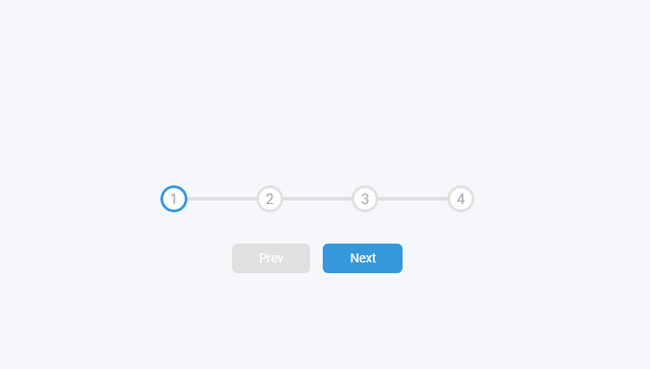
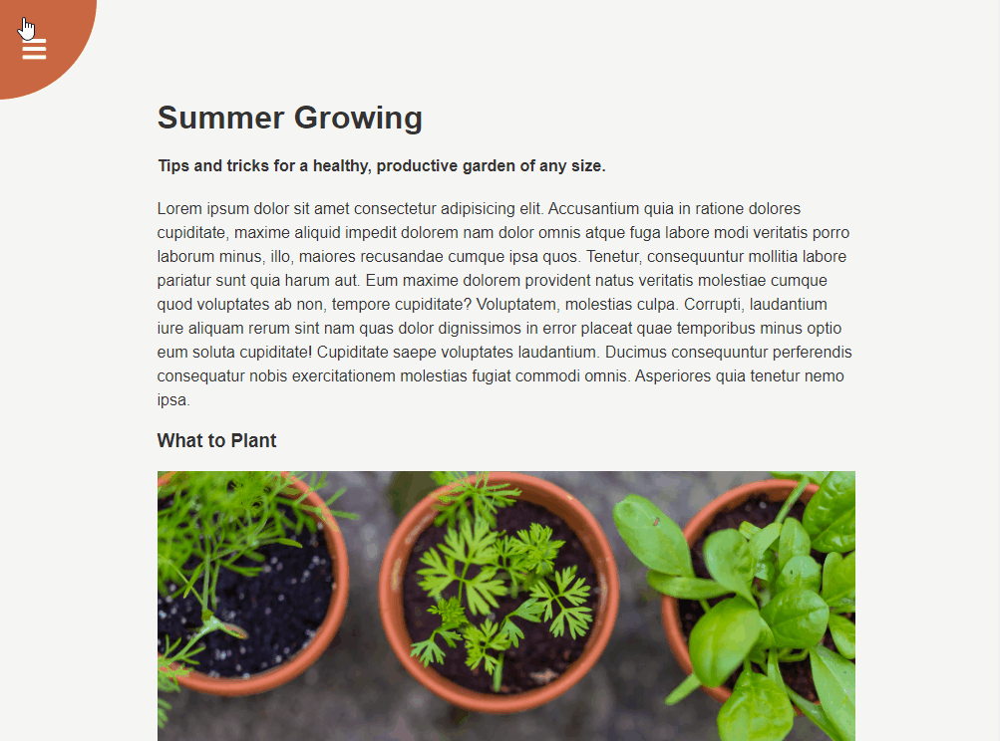
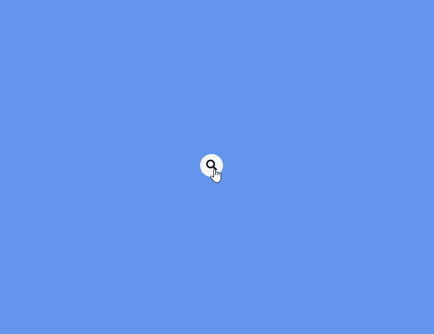
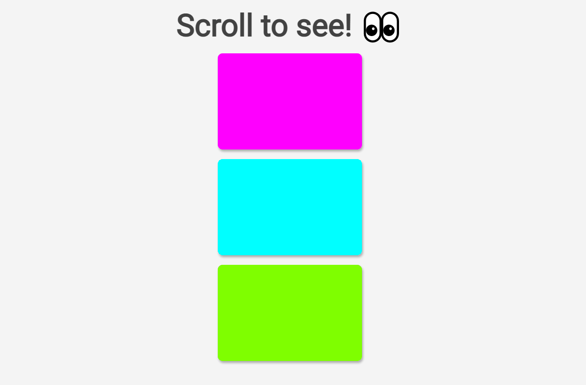
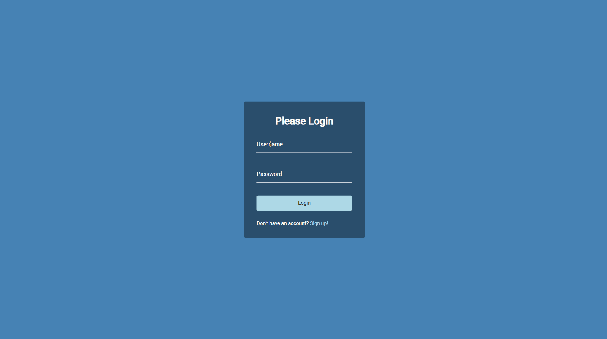
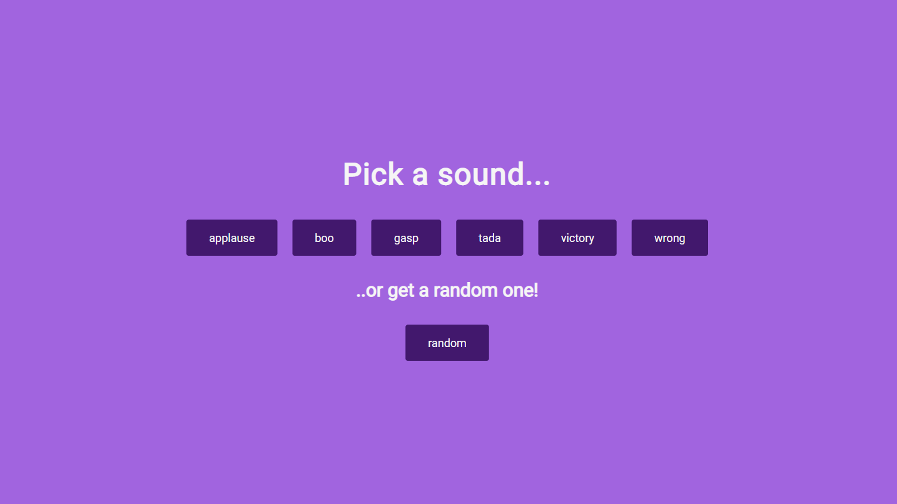
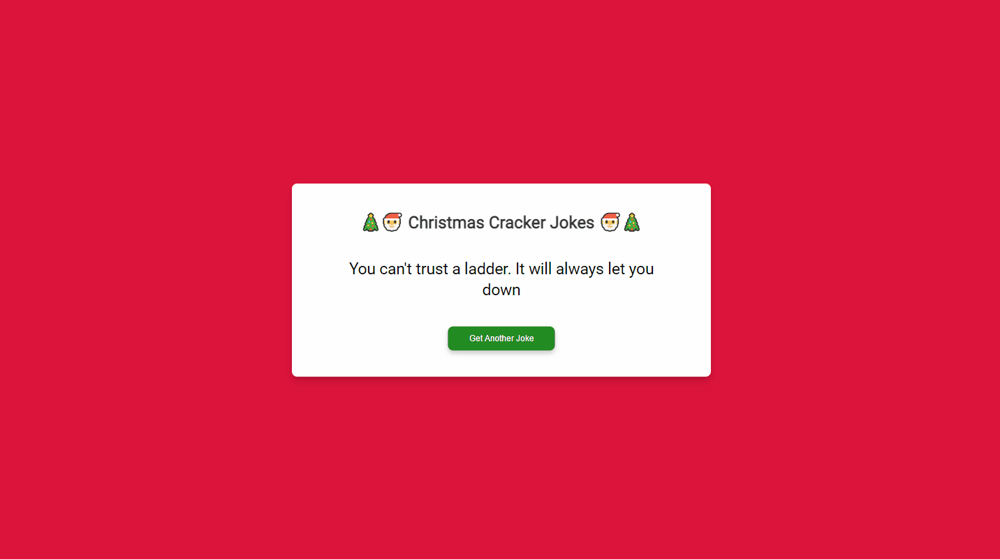
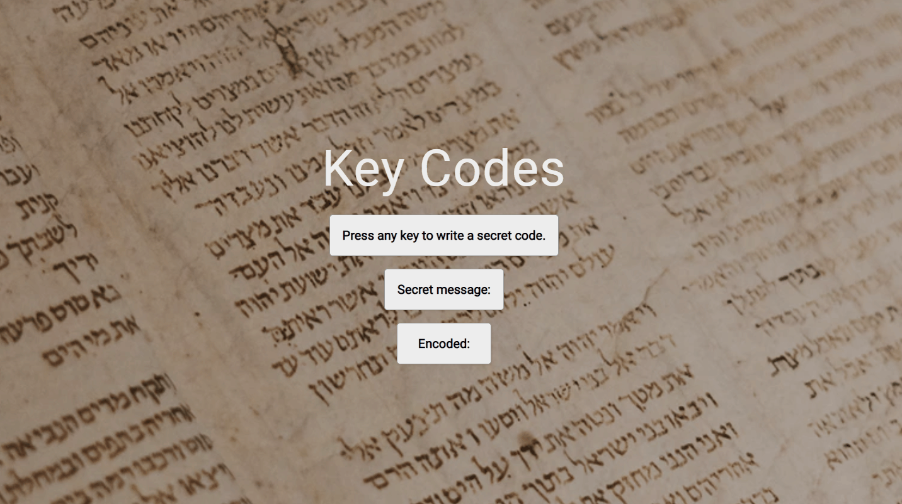

# 50 Mini Projects

## ℹ About
Completing the [50 Projects 50 days](https://www.udemy.com/course/50-projects-50-days) course by Brad Traversy and Florin Pop to practise basic JS and CSS.

## 🌟🌟🌟 Modifications 🌟🌟🌟 
Every project I'll be trying to extend my knowledge by adding or modifying something. 

## 1. Expanding Cards
Simple event listener to expand an image by adding or removing the class of the div with a flex property.

🌟 Added National Park theme with title, pictures, background color and text.

## 2. Progress steps
Pagination with prev and next button. Circle border and line change to simulate indication of page selected.

## 3. Rotating Nav
Button with Nav icon in the top left corner that pivots the page from that position to display a nav in the bottom left corner of the page. Event handler on the nav icons.

🌟 Added content and different colour circle.

## 4. Hidden Search
Rounded search button that shows search input field when clicked.

🌟 Added rounded borders and join between input and button.

## 5. Blurry Loading
Over 3 seconds background picture comes into focus and loading% counter counts up and blurs out of focus. 

🌟 Added title, different blur amount and background pic.

## 6. Scroll Animation
Box move in and out from alternating side as the user scolls down and up the page.

🌟 Added rotating/flicking motion and alternating colours.

## 7. Split Landing page
Split page with widths that grow and shrink on mouseover. ::before used to create partially transparent overlay.

🌟 Added different overlay and pictures.

## 8. Form Wave
When a form input field is active, a span class is added to each letter of the label with tranlate(Y) and a delay based on the index to create a wave effect.

## 9. Sound board
Buttons that play corresponding sound. First stops any other sound that might be playing.

🌟 Added random sound button that selects a random sound from the above options.

## 10. Dad Joke API
Gets a random joke from https://icanhazdadjoke.com/api.

🌟 Added Christmas theme, scale in and clear prev joke functionality while waiting for new fetch reqponse.

## Keycodes
Event listener on keydown to print the key and keycode. Note: keycode is now deprecated - used here for learning purposes.

🌟 Added accumulating ciphertext strings and theme.

