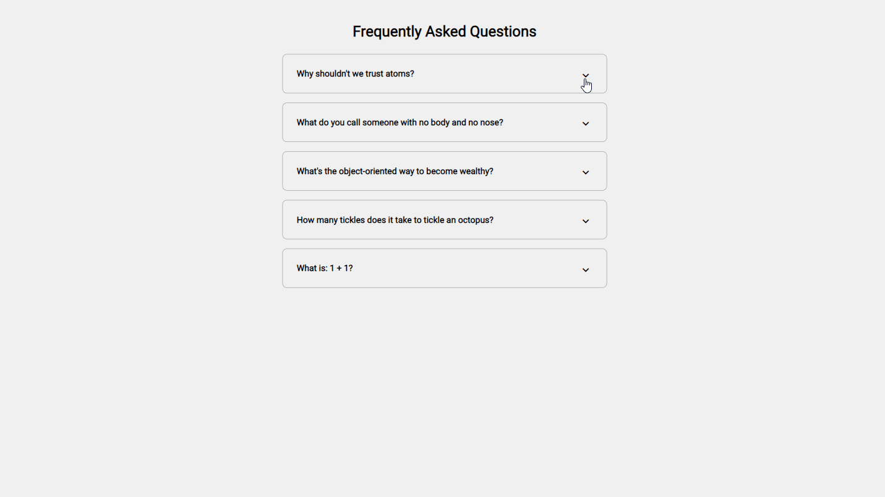
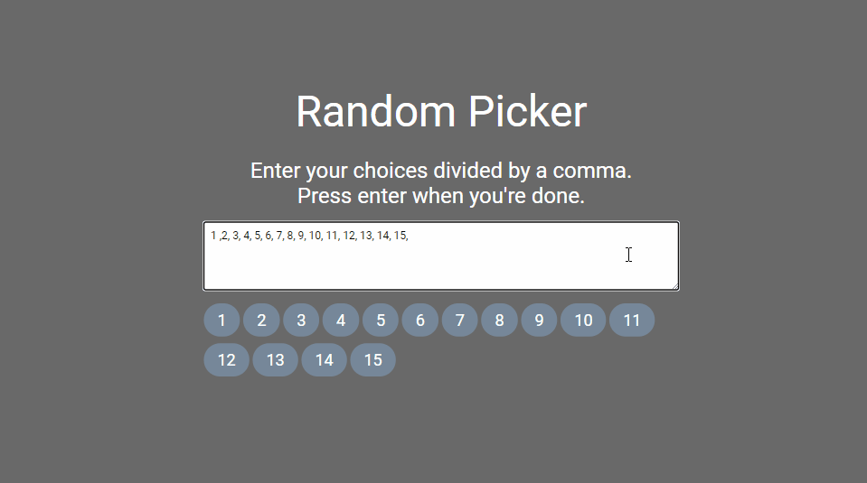
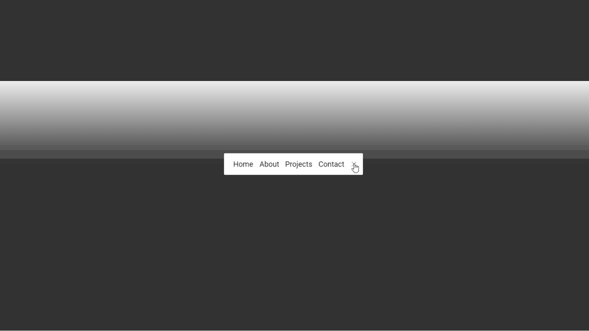
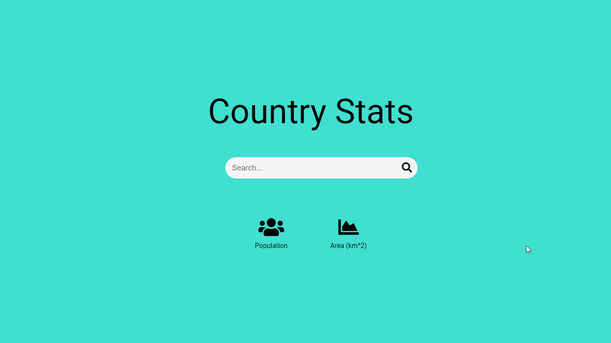
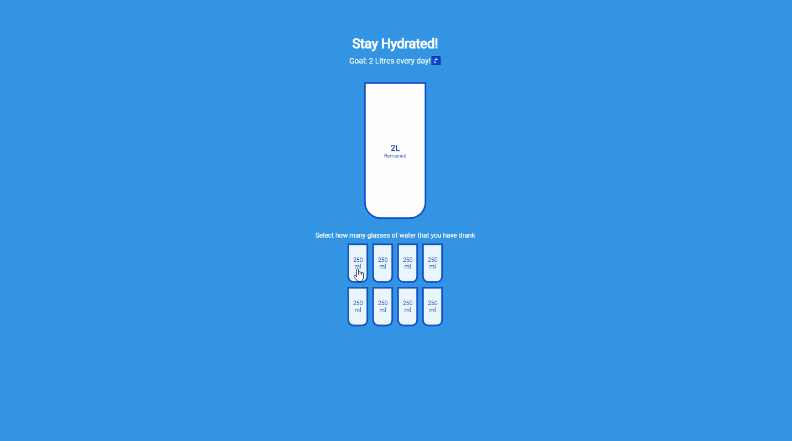
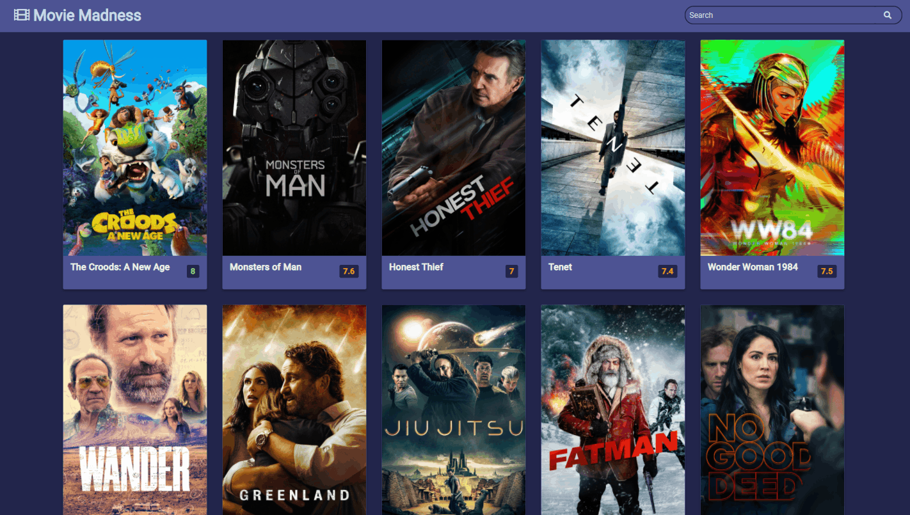
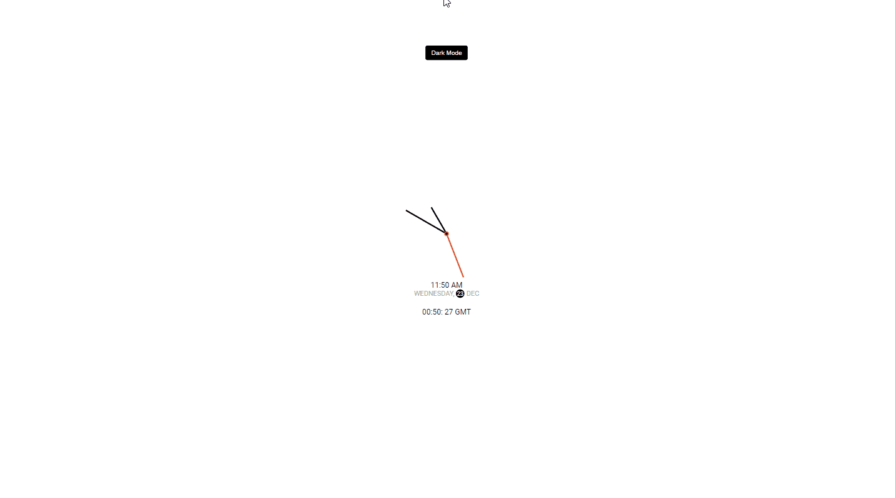
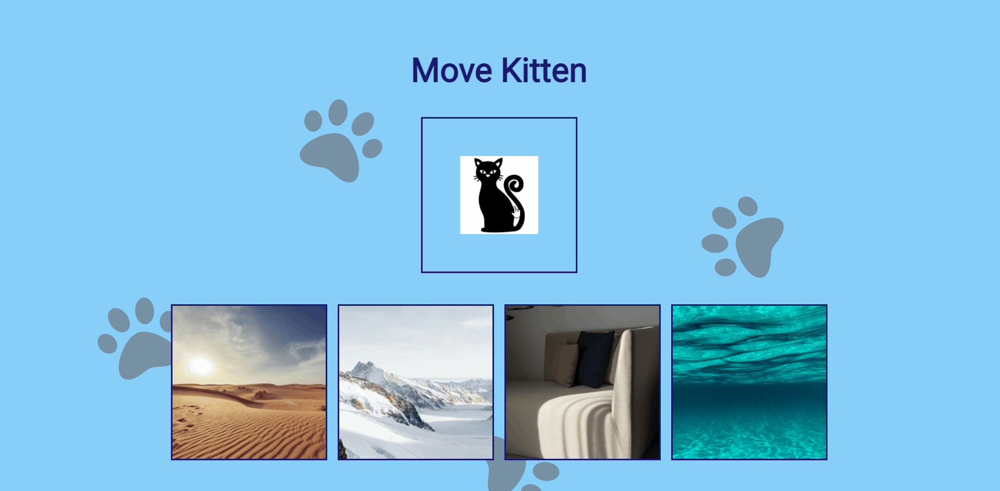
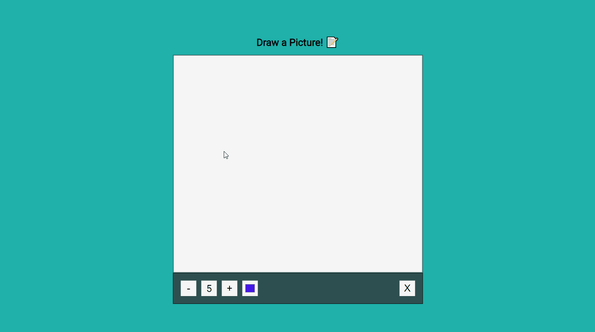
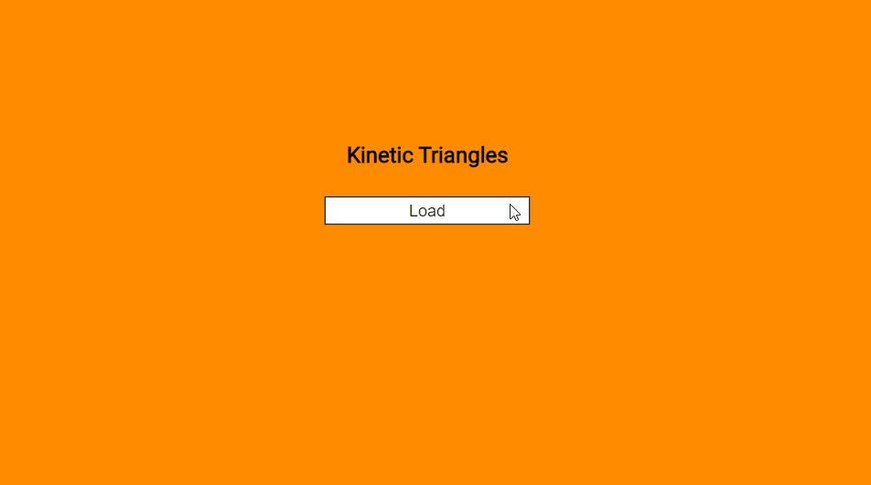

# 50 Mini Projects

## ℹ About
Completing the [50 Projects 50 days](https://www.udemy.com/course/50-projects-50-days) course by Brad Traversy and Florin Pop to practise basic JS and CSS.

## 🌟🌟🌟 Modifications 🌟🌟🌟 

Every project I'll be trying to extend my knowledge by adding or modifying something. 

## 1. Expanding Cards

Simple event listener to expand an image by adding or removing the class of the div with a flex property.

🌟🌟 Added National Park theme with title, pictures, background color and text.

## 2. Progress steps

Pagination with prev and next button. Circle border and line change to simulate indication of page selected.

## 3. Rotating Nav

Button with Nav icon in the top left corner that pivots the page from that position to display a nav in the bottom left corner of the page. Event handler on the nav icons.

🌟🌟 Added content and different colour circle.

## 4. Hidden Search

Rounded search button that shows search input field when clicked.

🌟🌟 Added rounded borders and join between input and button.

## 5. Blurry Loading

Over 3 seconds background picture comes into focus and loading% counter counts up and blurs out of focus.

🌟🌟 Added title, different blur amount and background pic.

## 6. Scroll Animation

Box move in and out from alternating side as the user scolls down and up the page.

🌟🌟 Added rotating/flicking motion and alternating colours.

## 7. Split Landing page

Split page with widths that grow and shrink on mouseover. ::before used to create partially transparent overlay.

🌟🌟 Added different overlay and pictures.

## 8. Form Wave

When a form input field is active, a span class is added to each letter of the label with tranlate(Y) and a delay based on the index to create a wave effect.

## 9. Sound board

Buttons that play corresponding sound. First stops any other sound that might be playing.

🌟🌟 Added random sound button that selects a random sound from the above options.

## 10. Dad Joke API

Gets a random joke from <https://icanhazdadjoke.com/api>.

🌟🌟 Added Christmas theme, scale in and clear prev joke functionality while waiting for new fetch reqponse.

## 11. Keycodes

Event listener on keydown to print the key and keycode. Note: keycode is now deprecated - used here for learning purposes.

🌟🌟 Added accumulating strings to show a typed message and the encoded version for a secret message theme.

## 12. FAQ

Event Listener on Chevron that expands container to include FAQ, styling and font awesome icon.

🌟🌟 Made this into a react project! Stored data in seperate faqData file to simulate API response.

## 13. Random Picker

Creates tags of user input, the flashes random tags before finally selecting a random tag.

🌟🌟 Added multiple colours that are randomly selected rather than just one and the heading where each letter flashes a random colour.

## 14. Animated Nav

Nav with increasing width when toggled and "=" icon that spins into "X"

🌟🌟 Added linear gradient and monochrome theme.

## 15. Increment Counter

Increment counter that visually counts up at set interval to target number.

🌟🌟 Instead of hard coding numbers, get data from [RestCountries API](https://restcountries.eu/). Add input field to search for country to display data from.

## 16. Drink Water

8 small cups with click event listeners. When clicked the class will toggle to full (as will any less than it) or empty. Big cup updates with a percentage of how many small cups are full to show total.

## 17. Movie

Gets movie data from <https://themoviedb.org> API and displays title, image, colour-coded rating and overview. Search functionailty.

🌟🌟 Added title and button in search bar

## 18. Background Slider

Image carosal with smaller image in the front and large background image with opacity overlay behind. Both change on clicking arrows.

🌟🌟 Changed opacity, pics, added heading and animal "don't shop" theme.

## 19. Clock

Analog and digital clock using JS Date object.

🌟🌟 Added GMT clock - essential in aviation! ✈

## 20. Ripple Button

Creates ripple effect with increasing circle animation constrained inside a button.

🌟🌟 Added second button with outside ripple effect that creates a multiple ripples on the background in random positions.

## 21. Drag and Drog

Using Drag and Drop API and changing classes to get drag and drop animation.

🌟🌟 Added background pics, pawprints and kitten theme. Changed hover css.

## 22. Drawing App

Using Canvas API to create a drawing pad that user can draw on, select colour and pen weight and clear the pad.

## 23. Kinetic Loader

Triangles with rotate animation.

🌟🌟 Added loading button with event listener. Triangles spin to simulate "loading" with a setTimeout hard coded period.

